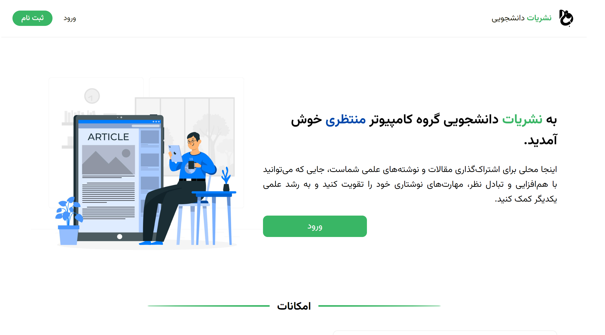
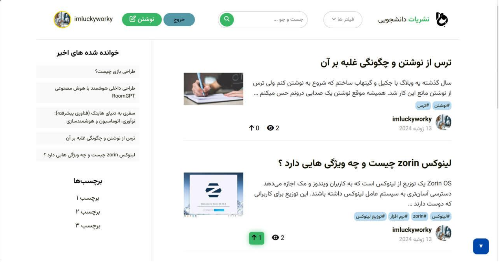
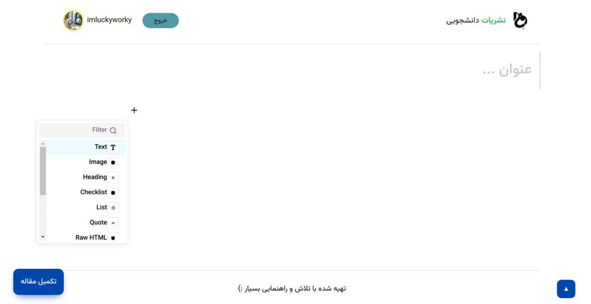

# Django Uni Blog

A university-focused blogging platform built with **Django**, designed as a space for university students to create, share, and discover educational content.

## 📸 Project Preview

> Home page



---

## ✨ Features

* 📝 Create and publish blog articles
* 👤 User accounts and profiles
* 🏷️ Article tagging and categorization
* 👁️ Article view tracking
* ✍️ Rich-text article editor using Editor.js
* 🖼️ Image upload and management
* 🔐 Authentication and account management
* 📊 User profiles and activity information

---

## 🛠️ Technologies

### Backend

* **Python**
* **Django 5**
* Django Templates

### Database

* **MySQL**

### Frontend

* HTML
* CSS
* JavaScript
* Django Template Language

### Django Packages

* `django-editorjs-fields` — Editor.js integration
* `django-taggit` — Tag management
* `django-hitcount` — Article view counting
* `django-etc` — Additional Django utilities
* `Pillow` — Image processing

---

## 📁 Project Structure

```text
django-uni-blog/
│
├── accounts/          # User authentication and account functionality
├── articles/          # Blog articles and related functionality
├── profiles/          # User profiles
├── config/             # Django project configuration
├── templates/          # HTML templates
├── static/             # Static files
├── media/              # Uploaded media
├── uploads/            # Uploaded images
│
├── manage.py
├── requirement.txt
└── README.md
```

---

## 🚀 Getting Started

### 1. Clone the repository

```bash
git clone https://github.com/Eh3anLo/django-uni-blog.git
cd django-uni-blog
```

### 2. Create a virtual environment

**Windows**

```bash
python -m venv venv
venv\Scripts\activate
```

**Linux / macOS**

```bash
python -m venv venv
source venv/bin/activate
```

### 3. Install dependencies

```bash
pip install -r requirement.txt
```

### 4. Configure the database

The project uses **MySQL**.

Create a MySQL database and configure the database credentials in the Django settings.

### 5. Run migrations

```bash
python manage.py migrate
```

### 6. Create an admin account

```bash
python manage.py createsuperuser
```

### 7. Start the development server

```bash
python manage.py runserver
```

Open the application at:

```text
http://127.0.0.1:8000/
```

---

## 🎯 Project Goal

The goal of this project is to create a blogging platform focused on university students, where users can share educational content and build a personal presence within the platform.

The project also provides a foundation for adding more interactive and community-oriented features in the future.

---

## 🔮 Future Plans

The project is currently focused on its core blogging functionality. Several additional features are planned for future development.

### 🎮 Gamification & Progression

A **gamification system** is planned to make the platform more engaging and encourage users to contribute more.

Possible future features include:

* User experience points (XP)
* Levels and progression
* Achievement badges
* Contribution-based rewards
* Activity milestones

> **Note:** The gamification and progression system has **not been implemented yet**.

### 🏆 Competitive System

A competitive layer is also planned for future versions of the platform.

Potential features include:

* User leaderboards
* Weekly/monthly rankings
* Contribution-based scoring
* Challenges and competitions
* Community achievements

> **Note:** The competitive system is **planned for future development and is not currently implemented**.

---

## 📚 What I Learned

Through this project, I practiced:

* Building web applications with Django
* Designing Django models and relationships
* Working with Django ORM
* User authentication and profile management
* Working with MySQL
* Handling media and image uploads
* Building reusable Django templates
* Integrating third-party Django packages
* Implementing article tagging and view tracking
* Integrating a rich-text editor

---

## 📷 Screenshots

### Dashboard page



### New Article Page



---

## 👨‍💻 Author

**Ehsan Lotfi**

Computer Engineering Student & Software Developer

[GitHub](https://github.com/Eh3anLo)

---

## 📄 License

This project was created as an educational/university project.
